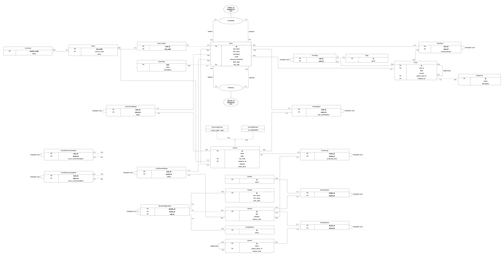
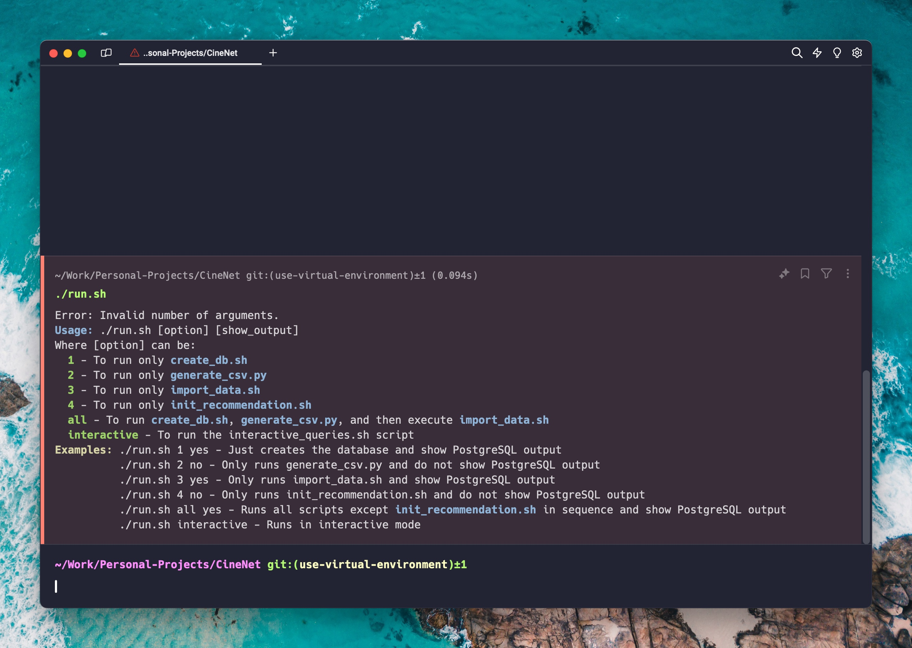
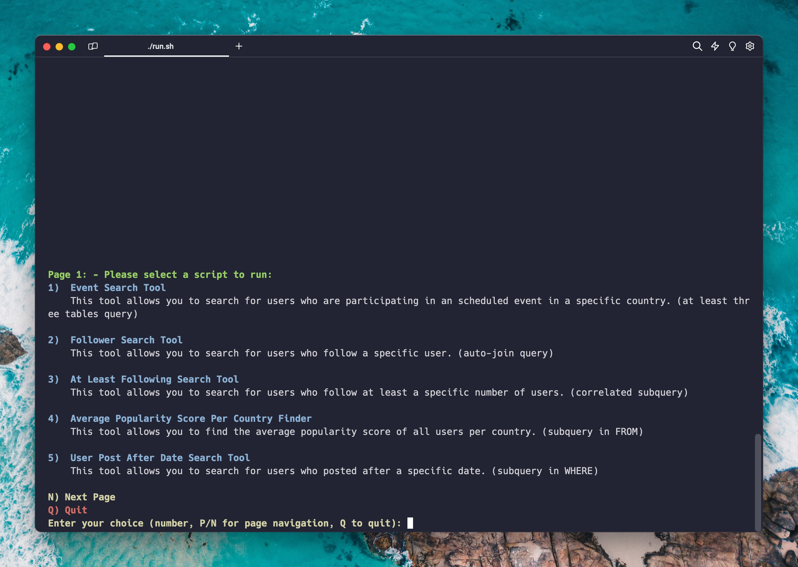
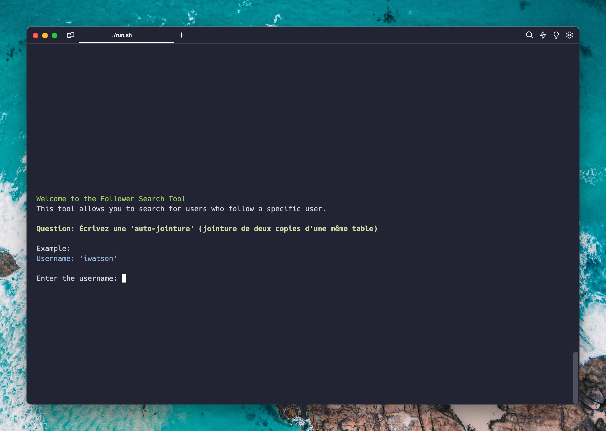
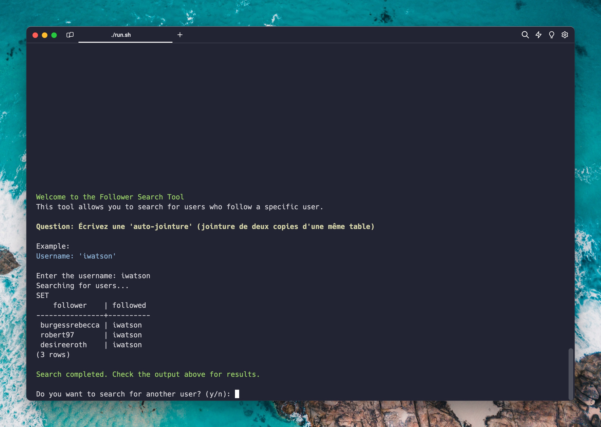
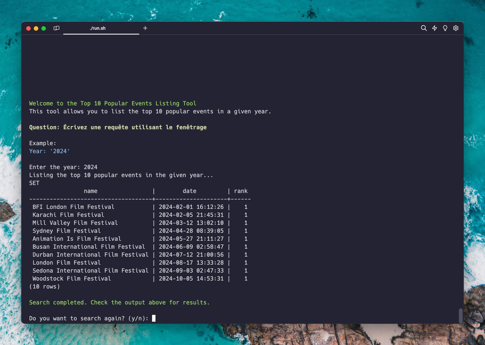
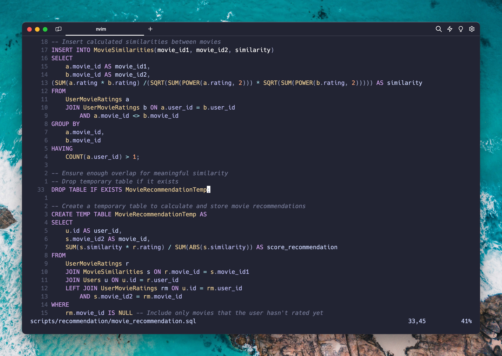
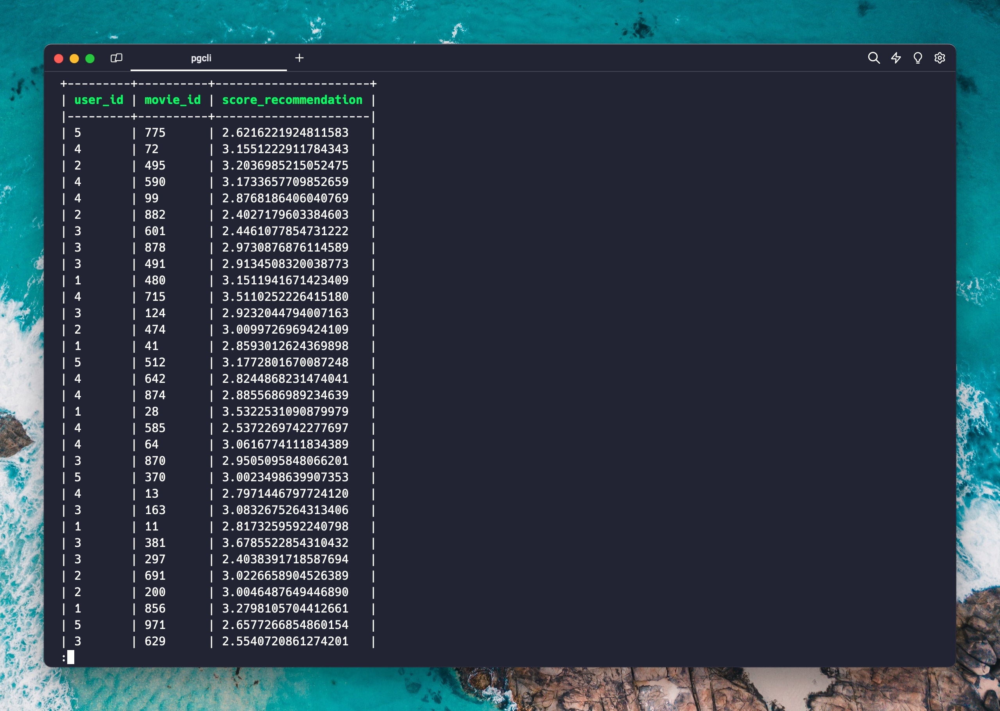

# CineNet

A social forum for cinema fans, based on a database, using PostgreSQL for data processing and interactive SQL queries for personalized content and recommendations.

### Table of Contents:

1. [Visuals](#visuals)
   - [ER Diagram](#er-diagram)
   - [Report](#report)
   - [Screenshots](#screenshots)
2. [Installation](#installation)
3. [Usage](#usage)
   - [Usage Examples](#usage-examples)
4. [Errors on the ER Diagram](#errors-on-the-er-diagram)

### Visuals:

#### ER Diagram:

<div align="center">
    
</div>

The [ER Diagram](./er-diagram-cinenet/erd.pdf) for the CineNet database is available in the `er-diagram-cinenet` directory. The diagram was created using Lucidchart and exported as a PDF file.

#### Report:

The report for this project is available in French at [CineNet-Rapport](https://github.com/mathusanm6/CineNet-Rapport) github repository.

#### Screenshots:

<table style="width:100%; border-collapse:collapse;">
    <thead>
        <tr style="border-bottom:1px solid #dddddd;">
            <th style="padding: 8px;">Image</th>
            <th style="padding: 8px;">Description</th>
        </tr>
    </thead>
    <tbody>
        <tr style="border-bottom:1px solid #dddddd;">
            <td style="padding: 8px; text-align:center;">
                
            </td>
            <td style="padding: 8px;">Help Page</td>
        </tr>
        <tr style="border-bottom:1px solid #dddddd;">
            <td style="padding: 8px; text-align:center;">
                
            </td>
            <td style="padding: 8px;">Interactive Queries Page</td>
        </tr>
        <tr style="border-bottom:1px solid #dddddd;">
            <td style="padding: 8px; text-align:center;">
                
            </td>
            <td style="padding: 8px;">Follower Search Tool</td>
        </tr>
        <tr style="border-bottom:1px solid #dddddd;">
            <td style="padding: 8px; text-align:center;">
                
            </td>
            <td style="padding: 8px;">Follower Search Tool Result</td>
        </tr>
        <tr style="border-bottom:1px solid #dddddd;">
            <td style="padding: 8px; text-align:center;">
                
            </td>
            <td style="padding: 8px;">Top 10 Popular Events</td>
        </tr>
        <tr style="border-bottom:1px solid #dddddd;">
            <td style="padding: 8px; text-align:center;">
                
            </td>
            <td style="padding: 8px;">Movies Recommendation</td>
        </tr>
        <tr style="border-bottom:1px solid #dddddd;">
            <td style="padding: 8px; text-align:center;">
                
            </td>
            <td style="padding: 8px;">Movie Recommendation Results</td>
        </tr>
    </tbody>
</table>

### Installation:

1. Clone the Git repository to your local machine:

```bash
$ git clone git@github.com:mathusanm6/CineNet.git
```

2. Ensure you have PostgreSQL installed on your machine.

3. Ensure you have Python 3 installed on your machine.

4. Install the required Python dependencies by running the following commands at the root of the project:

```bash
$ python3 -m venv ./cinenet_env
$ source ./cinenet_env/bin/activate
$ python3 -m pip install -r requirements.txt
```

5. Ensure you have execution rights for the `run.sh` bash script by running the following command at the root of the project:

```bash
$ chmod +x ./run.sh
```

### Usage:

To use the CineNet program, run the `run.sh` bash script at the root of the project with the options and an additional argument to control the display of output details. Here are the options you can specify:

- **1**: To only run the `create_db.sh` script, which creates the database.
- **2**: To only run the `generate_csv.py` script, which generates CSV files from interesting data.
- **3**: To only run the `import_data.sh` script, which imports data from CSV files into the database.
- **4**: To only run the `init_recommendation.sh` script, which initializes the recommendation system.
- **all**: To run all scripts in order: `create_db.sh`, `generate_csv.py`, and finally `import_data.sh`.
- **interactive**: To start an interactive SQL query session on the database.

Each command except `interactive` takes an additional argument to control the display of output details. The options are:

- **yes**: To display PostgreSQL output details.
- **no**: To not display PostgreSQL output details.

#### Usage Examples:

```bash
$ ./run.sh 1 yes  # Only creates the database and displays PostgreSQL outputs
$ ./run.sh 2 no   # Only runs generate_csv.py without displaying PostgreSQL outputs
$ ./run.sh 3 yes  # Only runs import_data.sh and displays PostgreSQL outputs
$ ./run.sh 4 no   # Only starts init_recommendation.sh without displaying PostgreSQL outputs
$ ./run.sh all yes  # Runs all scripts except init_recommendation.sh in sequence and displays PostgreSQL outputs
$ ./run.sh interactive  # Starts an interactive SQL query session
```

### Errors on the ER Diagram

- The `Genre` table should not include a release date attribute, contrary to what is indicated on the diagram.
- The `Person` table should only contain the full name of the person, without distinction of first name, last name, etc.
- Several tables related to recommendations are not included in the ER diagram, as they are dynamically generated or were added after the initial design.
